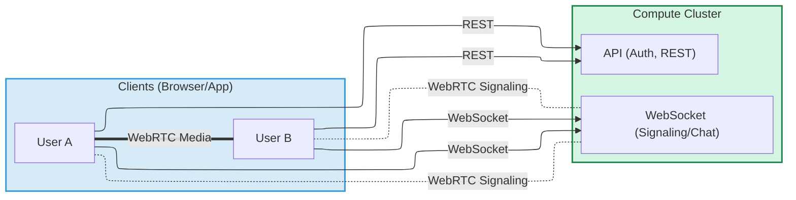
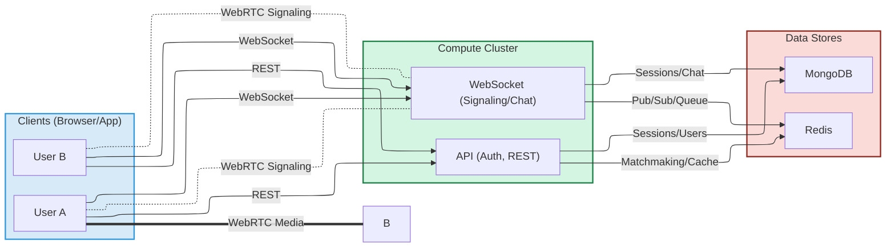
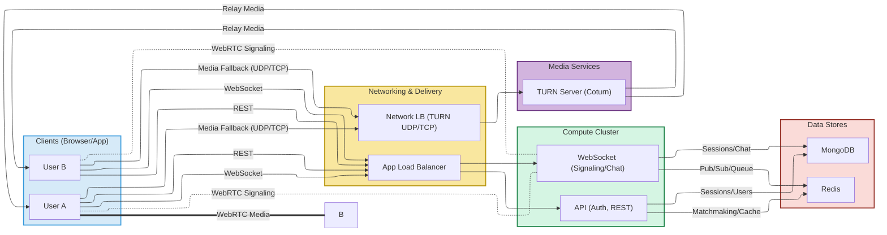
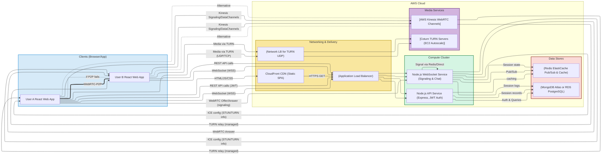
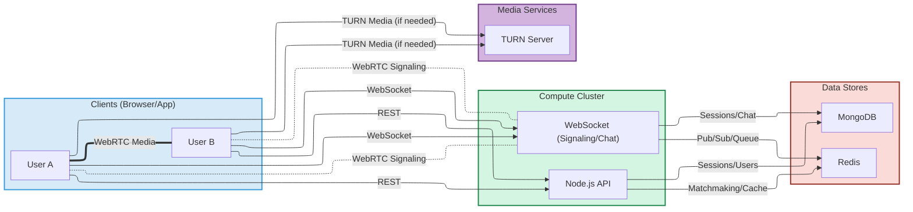
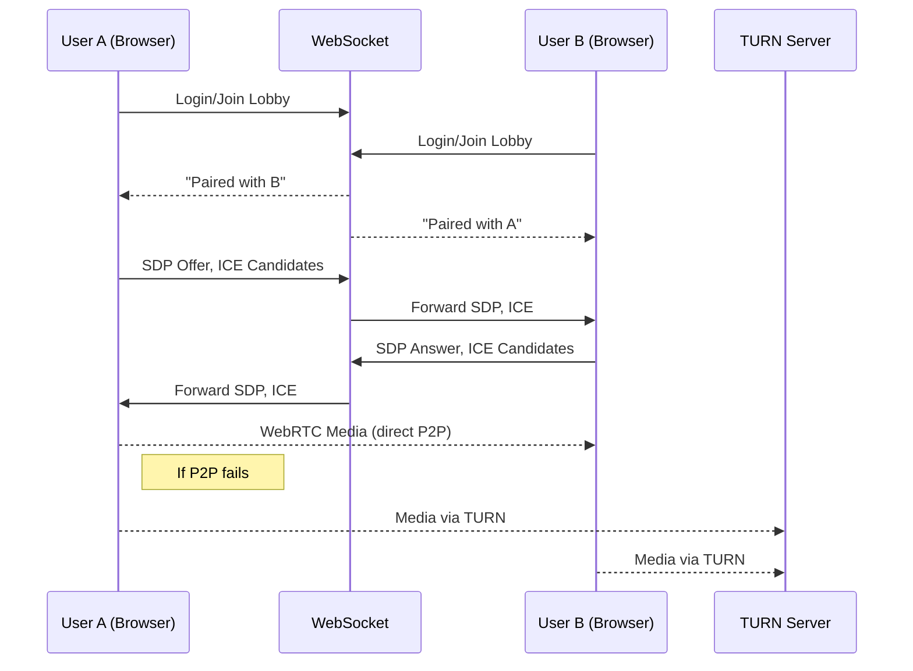

%% ----------------------------------

%% ----------------------------------

%% ----------------------------------

%% ----------------------------------

%% ----------------------------------

%% 3. COMPONENT TABLE (COLOR-KEYED LEGEND)

%% This is not a diagram but shown here in color for reference.

| Component      | Purpose                                 | Tech/Notes      |
|----------------|-----------------------------------------|-----------------|
| Frontend (SPA) | UI, camera, signaling, WebRTC           | React           |
| API            | Auth, user/session mgmt, REST endpoints | Node/Express    |
| WebSocket      | Realtime signaling, chat, pairing       | Node, Socket.IO |
| MongoDB        | Persistent storage for users/sessions   | MongoDB Atlas   |
| Redis          | Queue, matchmaking, pub/sub             | ElastiCache     |
| TURN Server    | NAT traversal, fallback media relay     | Coturn (EC2)    |

%% ----------------------------------

%% 4. GLOSSARY / LEGEND (Cloud, WebRTC, Networking Terms)

%% This is not a diagram but shown here, color-keyed to match above.

| WebRTC   | Browser tech for P2P video, audio, data (encrypted, low latency)      |
|---------------------|-----------------------------------------------------------------------|
| TURN     | Server to relay media when P2P fails (e.g. corporate firewalls)       |
| STUN     | Helps clients discover their public IP for NAT traversal              |
| ICE      | Interactive Connectivity Establishment; tries all possible network paths |
| SDP      | Session Description Protocol; describes connection media, codecs      |
| Socket.IO| Library for real-time WebSockets (with fallback)                      |
| JWT      | JSON Web Token; stateless authentication                             |
