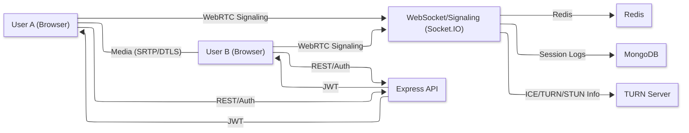
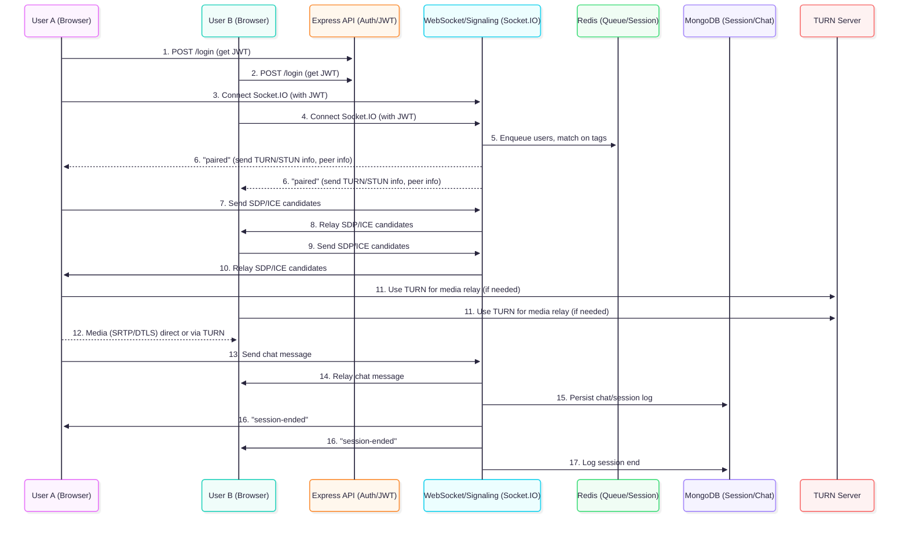

# Speed Connect – Cloud-Native 1:1 Video & Chat Starter

A production-ready, cloud-native template for real-time 1:1 video and chat.  
Built with MERN stack (MongoDB, Express, React, Node), Socket.IO, and self-hosted TURN/STUN for reliable peer-to-peer video, scalable to any infra.

---

## Features

- Instant, tag-based user matching (with Redis)
- Encrypted, stateless 1:1 video chat (WebRTC + TURN/STUN)
- Auto-disconnect after 5 minutes
- Real-time chat (Socket.IO)
- JWT authentication
- Fully containerized (Docker Compose)
- Terraform IaC and turnserver ready for production
- Scalable and analytics-ready (MongoDB, Redis)

---

## Architecture

### System Flow Diagram



---

### Sequence Diagram



---

## Getting Started (Local)

### Prerequisites

- Node.js and npm
- Docker and Docker Compose
- MongoDB, Redis (Docker Compose provided)
- [Optional] Terraform for infra provisioning

### Local Setup

1. **Clone the repo**

   ```bash
   git clone &lt;repo-url&gt; speed-connect
   cd speed-connect
   ```

2. **Configure environment variables**

   ```bash
   cp .env.example .env
   # Edit .env for MongoDB, Redis, TURN/STUN config
   ```

3. **Run with Docker Compose**

   ```bash
   docker-compose -f infra/docker-compose.yml up --build
   ```
   - Frontend: [http://localhost:5173](http://localhost:5173)
   - Backend (API): [http://localhost:4000](http://localhost:4000)

---

## Usage

- Open two browser tabs or devices, login as different users.
- Each user joins the lobby, is matched based on tags/interests.
- When paired, WebRTC 1:1 video and chat are enabled.
- Sessions auto-end after 5 minutes.

---

## Cloud Deployment

### Infrastructure

- **Terraform**: `infra/terraform/` for provisioning (edit variables for your VPC, subnets, etc).
- **TURN/STUN**: Customize `infra/turnserver.conf` for your deployment.
- **Docker**: Build images for backend/frontend for ECS, Kubernetes, or other container orchestration.

### Cloud Steps (Sample)

```bash
# Provision infra (update variables.tf)
cd infra/terraform
terraform init
terraform apply

# Build and push Docker images, update your orchestrator (ECS, K8s, etc)
```

---

## Technologies Used

- **Frontend**: React, Vite, WebRTC
- **Backend**: Node.js, Express, Socket.IO
- **Auth**: JWT (stateless)
- **Database**: MongoDB
- **Caching/Matchmaking**: Redis
- **Signaling/Chat**: Socket.IO
- **Media Relay**: Self-hosted TURN/STUN (or cloud)
- **Infra as Code**: Terraform
- **Containerization**: Docker, Docker Compose

---

## Extending

- Add analytics/stream processing via Mongo or Redis pubsub.
- Plug in external TURN (Twilio, Xirsys, or AWS if needed).
- Bring your own CI/CD pipeline—Docker-native.

---

## References

- [WebRTC for the Web](https://developer.mozilla.org/en-US/docs/Web/API/WebRTC_API)
- [Socket.IO Docs](https://socket.io/docs/)
- [MongoDB](https://www.mongodb.com/)
- [Redis](https://redis.io/)
- [Docker Compose](https://docs.docker.com/compose/)
- [Terraform](https://www.terraform.io/)

---

*Start local, scale globally. Built for zero-ops 1:1 video networking.*